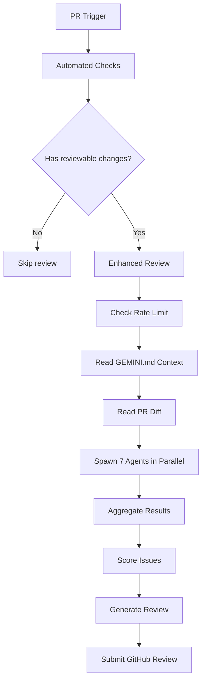

# Enhanced Review Workflow Documentation

## Overview

The Enhanced Review Workflow is a sophisticated multi-agent code review system that replaces the traditional single-agent approach with 7 specialized AI agents working in parallel. This system provides comprehensive code analysis, improved coverage, and detailed performance metrics.

## Architecture

### Core Components

1. **Subagent Review Harness** (`subagent-review-harness.js`)
   - Orchestrates all 7 specialized agents
   - Manages rate limiting and performance monitoring
   - Coordinates agent execution and result aggregation

2. **Specialized Agents**
   - **Requirements Agent**: Analyzes requirements compliance and specification adherence
   - **Bug Hunter Agent**: Identifies potential bugs and logical errors
   - **Security Agent**: Detects security vulnerabilities and best practice violations
   - **TypeScript Agent**: Checks TypeScript-specific issues and type safety
   - **Architecture Agent**: Reviews architectural patterns and design decisions
   - **Testing Agent**: Identifies missing tests and testing improvements
   - **React Agent**: Analyzes React-specific patterns and best practices

3. **Supporting Utilities**
   - **Rate Limiter**: Manages GitHub API rate limits
   - **Performance Monitor**: Tracks execution metrics and performance
   - **Confidence Scorer**: Scores issues based on confidence levels
   - **GitHub Reviewer**: Generates review comments and GitHub reviews

### Workflow Execution



## Configuration

### Environment Variables

- `GEMINI_AI_KEY`: Your Gemini AI API key
- `GITHUB_TOKEN`: GitHub token for API access (automatically provided in GitHub Actions)
- `BOT_GITHUB_TOKEN`: Bot token for submitting reviews

### Performance Configuration

The system uses a configuration system located in `config/performance-config.js`:

```javascript
export const PerformanceConfig = {
  rateLimit: {
    minRemainingThreshold: 3,
    fallbackRemaining: 15,
    fallbackResetInterval: 60000,
    maxWaitTime: 300000
  },
  agents: {
    agentTimeout: 120000,
    maxConcurrentAgents: 7,
    retryAttempts: 2
  },
  // ... other settings
};
```

## Usage

### CLI Interface

```bash
# Run enhanced review manually
node .github/scripts/subagent-review-harness.js \
  --pr-number 123 \
  --pr-title "Feature: Add user authentication" \
  --pr-sha abc123def456 \
  --diff-file /tmp/pr.diff \
  --verbose

# Use with verbose logging for debugging
node .github/scripts/subagent-review-harness.js \
  --pr-number 123 \
  --pr-title "Feature: Add user authentication" \
  --pr-sha abc123def456 \
  --diff-file /tmp/pr.diff \
  --verbose
```

### GitHub Actions

The workflow is triggered automatically on:
- PR opened
- PR synchronized (updated)
- PR reopened

Skips execution for:
- Draft PRs
- PRs with no reviewable file changes

### Performance Monitoring

The system provides comprehensive performance metrics:

```json
{
  "reviewComment": "...",
  "performanceMetrics": {
    "duration": 15432,
    "agentsSpawned": 7,
    "issuesFound": 12,
    "apiCalls": 8,
    "errors": 0,
    "averageAgentTime": 1876,
    "peakMemory": {
      "heapUsed": 45,
      "heapTotal": 128
    },
    "efficiency": 46.7
  }
}
```

## Agent Specializations

### 1. Requirements Agent
- Checks if implementation matches requirements
- Validates feature completeness
- Identifies missing functionality
- Confidence threshold: 60-80%

### 2. Bug Hunter Agent
- Finds logical errors and edge cases
- Identifies potential crashes
- Checks for null/undefined handling
- Confidence threshold: 70-90%

### 3. Security Agent
- Detects security vulnerabilities
- Checks for hardcoded credentials
- Validates input sanitization
- Confidence threshold: 80-95%

### 4. TypeScript Agent
- Checks type annotations
- Validates interface usage
- Identifies type-related issues
- Confidence threshold: 65-85%

### 5. Architecture Agent
- Reviews design patterns
- Checks for architectural consistency
- Identifies coupling issues
- Confidence threshold: 60-75%

### 6. Testing Agent
- Identifies missing tests
- Suggests test improvements
- Validates test coverage
- Confidence threshold: 50-70%

### 7. React Agent
- Checks React best practices
- Identifies performance issues
- Validates component structure
- Confidence threshold: 65-85%

## Error Handling

### Rate Limit Management
- Automatically waits for rate limit reset
- Fallback to mock data if GitHub API fails
- Maximum wait time: 5 minutes

### Agent Failures
- Individual agent failures don't stop the review
- Failed agents are marked in metrics
- Review continues with available agents

### Diff Processing
- Skips binary files and dependencies
- Handles large diffs (100k char limit)
- Filters out non-reviewable files

## Performance Optimization

### Concurrency
- All 7 agents run in parallel
- Rate limiting prevents API throttling
- Efficient resource utilization

### Memory Management
- Monitors memory usage throughout execution
- Cleans up resources after completion
- Handles memory-intensive operations gracefully

### Caching
- Reuses GEMINI.md context
- Caches rate limit information
- Minimizes redundant API calls

## Troubleshooting

### Common Issues

1. **Rate Limit Exceeded**
   ```
   ⏳ Waiting 300s for rate limit reset...
   ```
   - The system automatically handles this
   - Review continues after reset

2. **Agent Timeout**
   ```
   Error: Agent execution timed out
   ```
   - Check agent timeout settings
   - Review GEMINI.md content length

3. **Missing Environment Variables**
   ```
   Error: Missing GEMINI_AI_KEY
   ```
   - Ensure API key is set
   - Check secret configuration in GitHub Actions

### Debugging Tips

1. Use `--verbose` flag for detailed logging
2. Check performance metrics for bottlenecks
3. Review agent completion times
4. Monitor memory usage patterns

## Contributing

### Adding New Agents

1. Create a new agent class extending AgentBase
2. Implement the `run` method
3. Add to the agents array in harness
4. Update configuration if needed

### Improving Performance

1. Adjust timeout settings in config
2. Optimize agent prompts
3. Implement caching mechanisms
4. Monitor performance metrics

## Future Enhancements

- Support for additional AI providers
- Custom agent configuration
- Advanced deduplication algorithms
- Integration with external tools
- Performance analytics dashboard